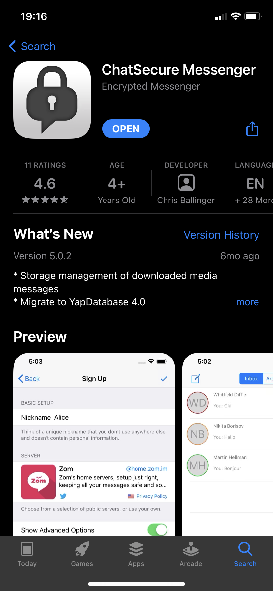
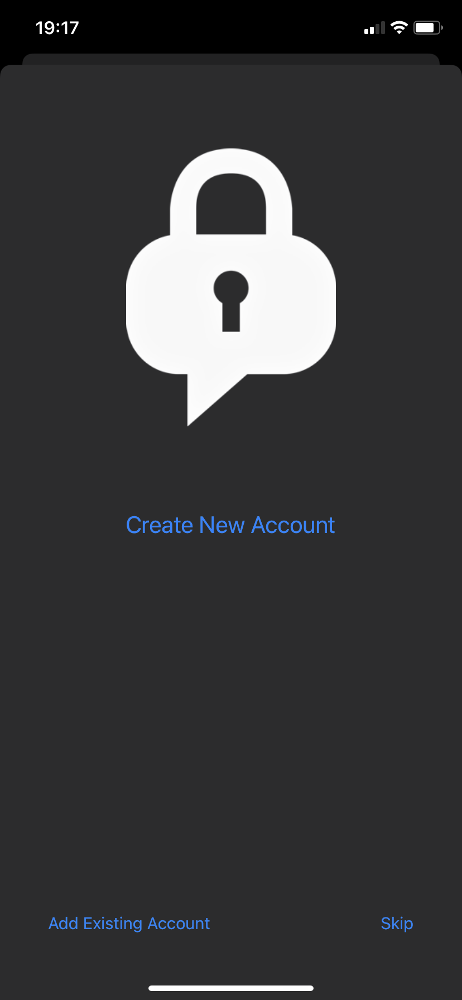
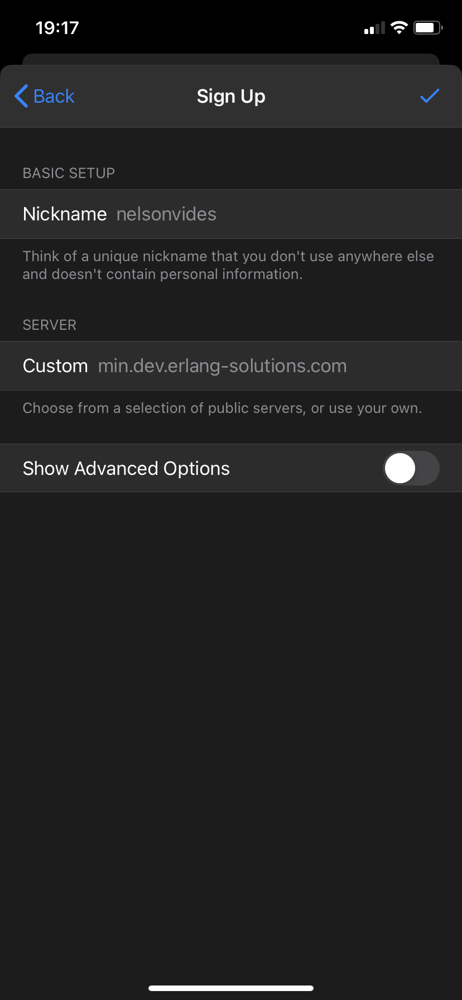
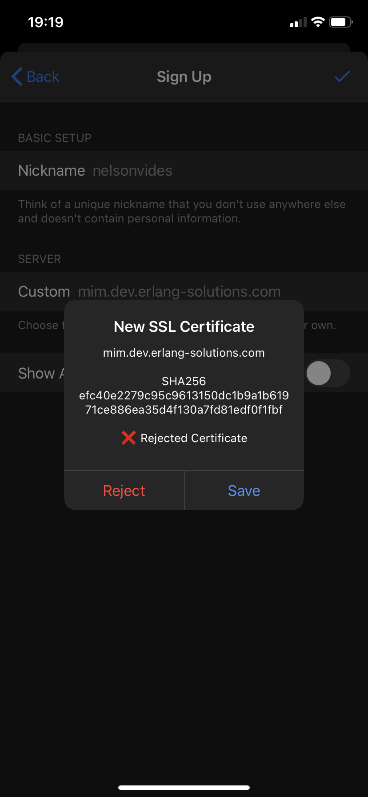
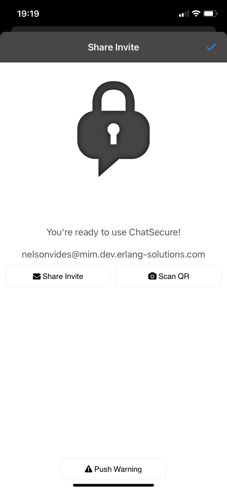
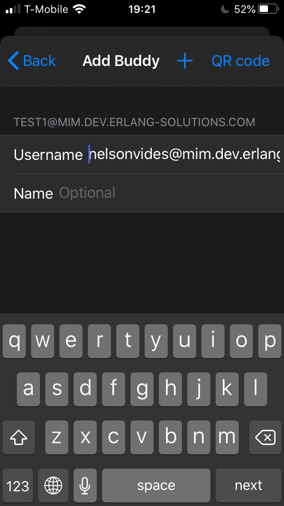
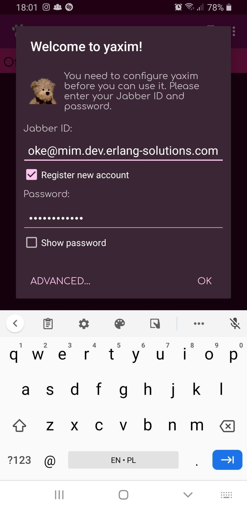
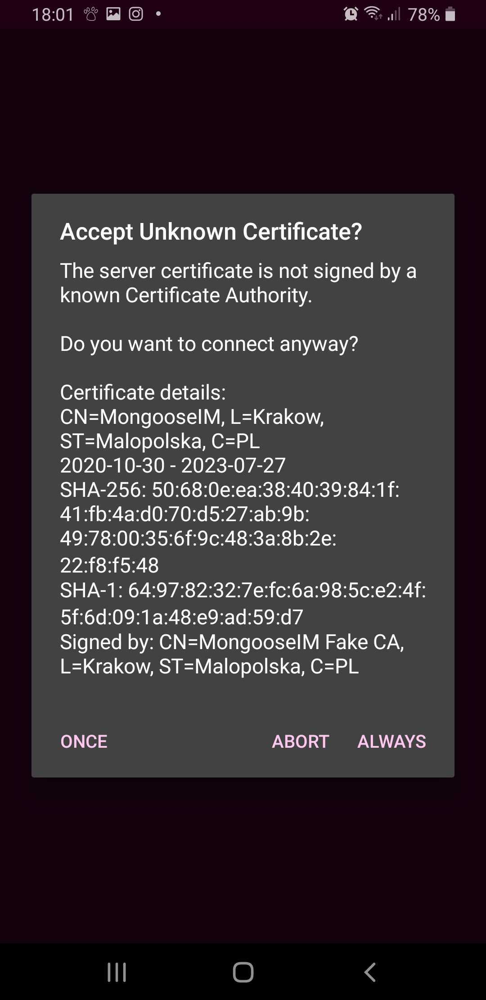
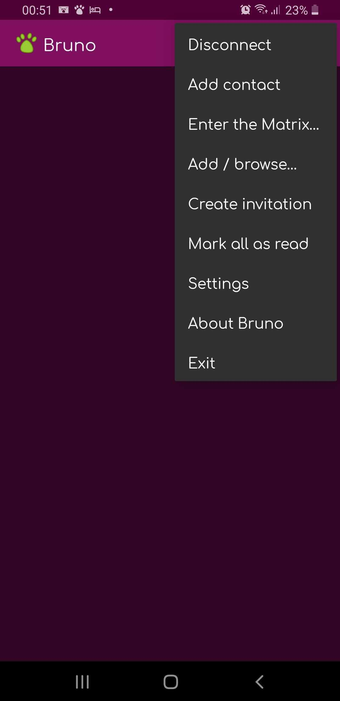
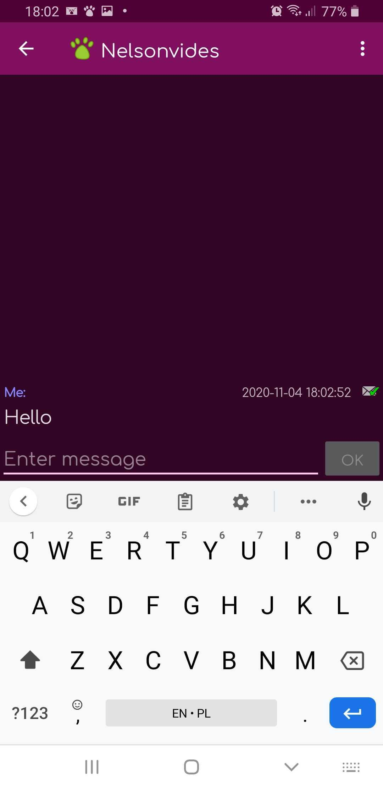

If you're in iOS, go to [this section](#ios)

If you're in Android, go to [this section](#android)

## iOS

If you're in iOS, install [ChatSecure](https://chatsecure.org/)

When you open it, click "Create New Account"

In the nickname, choose one as you wish. In the server field, type "mim.dev.erlang-solutions.com",
and then continue.

The app will notify you that the certificates aren't signed. Nevermind, this is just a demo server
with local certificates, just trust it — you can verify that the hash is as in the picture below :)

At this point, if successful, you'll have your account created with the following screen

To add me as a contact, click on the write button on the top left:

Click on "Add Buddy"

And add me as "nelsonvides@mim.dev.erlang-solutions.com"

## Android

If you're in Android, install [yaxim](https://yaxim.org/)

When you open it, click "Create New Account", and write a nickname as you wish, followed by
"@mim.dev.erlang-solutions.com", and mark the "Register new account" cell. Then click "OK":

The app will notify you that the certificates aren't signed. Nevermind, this is just a demo server
with local certificates, just trust it — you can verify that the hash is as in the picture below :)

To add me as a contact, click on the button with boxes on the top right,

And add me as "nelsonvides@mim.dev.erlang-solutions.com"

